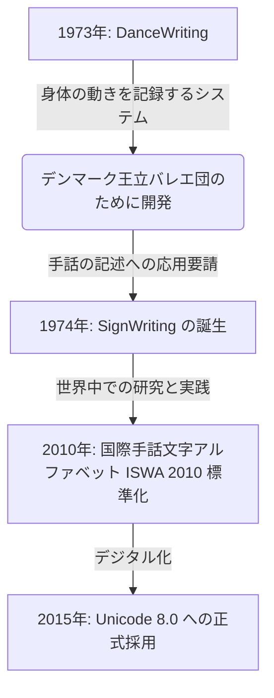

  <h3 style="margin-top: 0; font-family: var(--sl-font-heading);">💡 手話をそのまま「書き記す」ということ</h3>
  

    手話は、音ではなく空間での手の動きや顔の表情で表現される<strong>視覚言語</strong>です。話し言葉（日本語や英語）の文字で手話を書き表そうとすると、本来の手話特有の豊かな文法構造や空間的ニュアンスが失われてしまいます。
    <strong>Sutton式手話文字（SignWriting）</strong>は、手話が持つ三次元的な動きや表情を、そのまま紙面やWeb上に書き写すためにデザインされた画期的な記号表記システムです。
  

---

## SignWriting の歴史と背景

SignWritingは、1974年にアメリカのダンサーであり研究者である**ヴァレリー・サットン（Valerie Sutton）**によって開発されました。

もともとサットンは、バレエの振り付けや動きを記録するシステムである**DanceWriting**を開発していました。デンマークのコペンハーゲン大学の研究者たちから「このシステムを使えば、これまで書き言葉がなかった手話も正確に記述できるのではないか」と提案されたことがきっかけとなり、手話専用のシステムである **SignWriting** が誕生しました。

現在では、国際手話文字アルファベット（ISWA 2010）として記号セットが標準化され、アメリカ手話（ASL）、日本手話（JSL）、ブラジル手話（LIBRAS）など、世界各地の数十以上の異なる手話言語の辞書作成や教科書、児童書などの出版、言語研究で広く使用されています。

---

## なぜ SignWriting が必要なのか？

手話を表す方法には、映像の録画や日本語（書き言葉）での翻訳などがあります。しかし、SignWritingには以下のような他にない強力なメリットがあります。

1. **手話の文法と言語的ニュアンスをそのまま維持**
   手話は独自の文法構造を持っており、日本語の文法とは大きく異なります。日本語に翻訳してしまうと失われてしまう手話特有の構造や空間的な「主語・目的語の配置」を、そのままの順序で書き残せます。

2. **静止画による高い一覧性と教育効果**
   映像は時間軸に沿って再生する必要がありますが、文字は紙に印刷して「本」として読んだり、Webページをサッとスクロールして概観したりできます。子供たちが手話を視覚的に学ぶ際の教育用ツールとして非常に強力です。

3. **デジタルデータとしての検索性・保存性**
   SignWritingは単なる画像ではなく、それぞれの記号がデジタル文字（テキストデータ）として規格化されています。これにより、「この手形状を使う手話を辞書から検索する」といった文字としての高度な情報処理が可能になっています。

---

## SignWriting の構成要素

SignWritingは、大きく分けて以下の3つの身体部位・動作に対応する記号を組み合わせて作られます。

  
  

    

      👐 手の形 (Handshapes)
    

    

      <h4 style="margin: 0 0 0.5rem 0; font-family: var(--sl-font-heading); font-size: 1.2rem; color: var(--brand-violet);">役割：手の形や指の伸び方、手のひらの向きを記述</h4>
      

        握り拳（四角形）、平らな手（五角形・長方形）、指先を曲げた手（円）など、手話で使われる多様な手のポーズやその向きを正確に表現します。
      

    

  

  

    

      🔄 動きの記号 (Movements)
    

    

      <h4 style="margin: 0 0 0.5rem 0; font-family: var(--sl-font-heading); font-size: 1.2rem; color: var(--brand-cyan);">役割：手や腕の移動軌跡、関節の動き、接触などを記述</h4>
      

        移動方向を示す矢印や、手の接触を表すアスタリスク（タッチ）、こすり合わせるスパイラル（摩擦）など、動的な軌跡や強弱を視覚的に表現します。
      

    

  

  

    

      😊 顔と頭部 (Face & Head)
    

    

      <h4 style="margin: 0 0 0.5rem 0; font-family: var(--sl-font-heading); font-size: 1.2rem; color: var(--brand-violet);">役割：表情、目線、眉の動き、頭の傾きを記述</h4>
      

        手話の文法表現に極めて重要な非手指動作（NMM）を記述します。視線方向を示す矢頭、口の形状（微笑みや丸めるなど）、首の傾き（斜線）を含みます。
      

    

  

これらのパーツを、手話を実際に行う際の位置関係（頭の周り、胸の前、左右の手の位置関係）の通りに二次元的にレイアウトして、ひとつの「手話文字」が完成します。

次のセクションからは、これらのパーツの具体的な意味や読み書きのルールを、順番に詳しく学んでいきましょう！

---

  <h4 style="margin-top: 0; color: var(--brand-accent);">🌐 関連リファレンス</h4>
  

    Sutton式手話文字のさらなる詳細な歴史や国際的な活動、最新のデジタルツールについては、公式ポータルサイトおよび各種関連リソースを参照してください。
  

  <ul style="margin: 0; padding-left: 1.2rem; font-size: 0.9rem; line-height: 1.6;">
    <li><a href="https://www.signwriting.org/" target="_blank" rel="noopener noreferrer" style="color: var(--brand-accent); font-weight: bold; text-decoration: underline;">Sutton SignWriting 公式サイト (SignWriting.org)</a></li>
    <li><a href="https://www.signbank.org/" target="_blank" rel="noopener noreferrer" style="color: var(--brand-accent); font-weight: bold; text-decoration: underline;">SignBank.org (手話記号辞書データベース)</a></li>
    <li><a href="https://www.signpuddle.org/" target="_blank" rel="noopener noreferrer" style="color: var(--brand-accent); font-weight: bold; text-decoration: underline;">SignPuddle Online (オンライン記号エディタ)</a></li>
  </ul>

